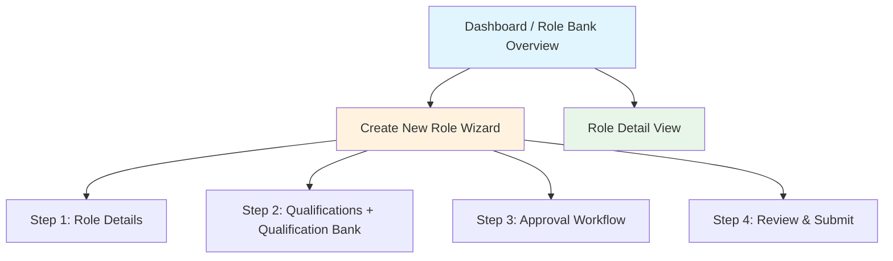

# Design Document: Role Bank & Qualification Management

## Overview

This feature provides a comprehensive Role Bank & Qualification Management system for an Early Stage Recruiting platform, built as Appian SAIL interfaces. The system enables HR Admins to create, manage, and track job roles through a multi-step wizard, define qualifications, configure approval workflows, and monitor role status from a centralized dashboard.

The implementation consists of SAIL UI mockup interfaces using `local!` variables with `a!map()` sample data, following the project's established patterns for mockup generation. The output will be `.sail` files in the `/output` folder.

## Architecture

The feature is organized into four primary SAIL interfaces, each corresponding to a major functional area:



### Interface Breakdown

1. **role-bank-dashboard.sail** — Dashboard with status cards, pending tasks widget, role bank table with search/filter
2. **role-wizard.sail** — Multi-step wizard using `a!wizardLayout` for role creation (4 steps), includes inline Qualification Bank component
3. **role-detail-view.sail** — Read-only detail view with tabs, approval timeline, and activity log

### Layout Decisions

| Interface | Top-Level Layout | Rationale |
|-----------|-----------------|-----------|
| Dashboard | `a!headerContentLayout` | Overview page with header bar, KPI cards, and data table |
| Wizard | `a!wizardLayout` | Multi-step form with progress indicator and navigation buttons |
| Detail View | `a!headerContentLayout` | Read-only display with tabs and collapsible sections |

## Components and Interfaces

### 1. Dashboard Interface (`role-bank-dashboard.sail`)

**Header**: Navigation bar with primary links (Dashboard, Roles, Candidates, Analytics, Settings)

**Status Cards Section** (using `a!columnsLayout` with 4 `a!columnLayout`):
- Draft Roles card — count + icon
- Pending Approval card — count + icon
- Approved Roles card — count + icon
- On Hold Roles card — count + icon
- Each card is clickable and filters the table below

**Quick Actions**: `a!buttonArrayLayout` with "Create New Role" (SOLID/ACCENT) and "View All Roles" (OUTLINE)

**My Pending Tasks Widget**: `a!cardLayout` containing a list of role items requiring the current user's action

**Role Bank Table**: `a!gridField` with columns:
- Role Title, Department, Hiring Manager, Status (tag), Openings, Filled, Pending Approval From, Date Created
- Actions column: Edit, View History, Duplicate, Archive (as link-style buttons)

**Search/Filter Bar**: Custom UX with `a!textField` for global search and `a!dropdownField` filters for Status, Department, Location, Hiring Manager (with TODO-CONVERTER comments)

### 2. Role Wizard Interface (`role-wizard.sail`)

Uses `a!wizardLayout` with 4 steps and built-in progress indicator.

**Step 1 — Role Details**:
- `a!textField`: Role Title (required)
- `a!dropdownField`: Department, Location, Employment Type
- `a!textField`: Hiring Manager (searchable picker pattern)
- `a!integerField`: Number of Openings
- `a!styledTextEditorField`: Job Description (rich text)
- `a!sideBySideLayout`: Salary Range Min / Max fields
- Validation: required field checks before "Next"

**Step 2 — Qualifications**:
- Two `a!sectionLayout` blocks: Minimum Qualifications, Preferred Qualifications
- Each qualification rendered via `a!forEach` over `local!minQualifications` / `local!preferredQualifications`
- Each entry: `a!dropdownField` (Type) + `a!textField` (Detail) + remove button
- "Add Qualification" button per section
- "Browse Qualification Bank" button opens inline sidebar
- Drag-and-drop simulated via up/down arrow buttons (SAIL limitation)

**Step 3 — Approval Workflow**:
- `a!radioButtonField`: Default Chain vs Custom Chain toggle
- Custom chain: `a!forEach` over `local!approvers` array
- Each approver: order number + `a!textField` (searchable user picker pattern) + remove button
- "Add Approver" button auto-increments order
- Visual chain: `a!richTextDisplayField` with approver stamps connected by arrow icons

**Step 4 — Review & Submit**:
- Read-only summary of all data from Steps 1–3
- Uses `a!sectionLayout` for each group (Role Details, Qualifications, Approval Chain)
- Submit button changes status to "Pending Approval"

**Wizard Buttons**: Next, Previous, Save Draft, Cancel (with unsaved changes confirmation)

### 3. Role Detail View Interface (`role-detail-view.sail`)

**Header Section**:
- Role title + status `a!tagField` (color-coded by status)
- Context-sensitive action buttons (e.g., Edit for Draft, Approve/Reject for Pending)

**Key Metrics Card**: `a!columnsLayout` with 3 columns showing Openings, Filled, Remaining as KPI-style displays

**Tabbed Content** (using tab pattern from `ui-guidelines/patterns/tabs.md`):
- **Overview Tab**: Role details in read-only fields
- **Qualifications Tab**: Minimum and Preferred qualifications listed with type tags
- **Approval Status Tab**: Timeline/flowchart of approval chain with status per approver

**Approval Timeline**: Vertical timeline using `a!forEach` over approvers, each showing:
- Stamp with initials, name, status tag (Approved/Pending/Rejected), date, comments

**Activity Log**: Chronological list of actions using `a!forEach` with timestamp + action description

### 4. Qualification Bank Component

**Inline Sidebar** within Step 2 of the wizard:
- `a!textField` for search
- `a!forEach` over `local!qualificationTemplates` filtered by search
- Each template: Type tag + Detail text + "Add" button
- Adding copies the template into the active qualification section

## Data Models

All data is modeled using `local!` variables with `a!map()` for mockup purposes.

### Role Object
```
a!map(
  roleId: Integer,
  title: Text,
  department: Text,
  location: Text,
  hiringManager: Text,
  numberOfOpenings: Integer,
  filled: Integer,
  employmentType: Text,          /* "Full-Time", "Part-Time", "Contract", "Intern" */
  jobDescription: Text,
  salaryRangeMin: Decimal,
  salaryRangeMax: Decimal,
  status: Text,                  /* "Draft", "Pending Approval", "Approved", "On Hold", "Archived" */
  pendingApprovalFrom: Text,
  dateCreated: Date,
  qualifications: List of Qualification,
  approvalChain: List of Approver,
  activityLog: List of Activity
)
```

### Qualification Object
```
a!map(
  qualificationId: Integer,
  type: Text,                    /* "Experience", "Education", "Skills", "Certification", "Other" */
  detail: Text,
  category: Text,                /* "Minimum", "Preferred" */
  orderIndex: Integer
)
```

### Approver Object
```
a!map(
  approverId: Integer,
  name: Text,
  order: Integer,
  status: Text,                  /* "Pending", "Approved", "Rejected" */
  actionDate: Datetime,
  comments: Text
)
```

### Activity Log Entry
```
a!map(
  activityId: Integer,
  action: Text,
  performedBy: Text,
  timestamp: Datetime,
  details: Text
)
```

### Qualification Template (for Qualification Bank)
```
a!map(
  templateId: Integer,
  type: Text,
  detail: Text,
  category: Text
)
```

### Status Color Mapping
| Status | Tag Color |
|--------|-----------|
| Draft | `"#6B7280"` (gray) |
| Pending Approval | `"#F59E0B"` (amber) |
| Approved | `"#10B981"` (green) |
| On Hold | `"#EF4444"` (red) |
| Archived | `"#9CA3AF"` (light gray) |


## Error Handling

### Validation Errors (Wizard)
- Required field validation on Step 1: inline error messages on empty fields, "Next" button disabled or blocked
- Step 2 warning when zero minimum qualifications (non-blocking, allows proceed)
- All validation uses SAIL's built-in `validations` parameter on input fields

### Confirmation Dialogs
- Cancel with unsaved changes: confirmation prompt before discarding
- Archive role: confirmation prompt before status change
- Remove qualification: confirmation prompt before deletion

### State Transition Guards
- Submit only allowed from "Draft" status
- Approve/Reject only allowed from "Pending Approval" status and only by the current pending approver
- Duplicate allowed from any non-archived status

### Data Integrity
- Qualification reorder operations must be atomic — no partial reorders
- Approval chain modifications must maintain consecutive ordering
- Duplication must produce a deep copy — no shared references


